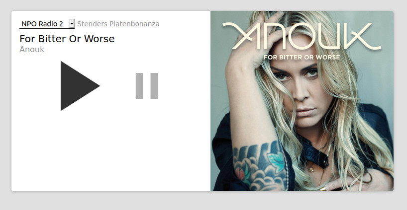

# Monorepo for homeremote-plugins

## homeremote-stream-player plugin



More details:

Client: [/packages/client](/packages/client)

Server: [/packages/server](/packages/server)

## Publish

* `nvm use`
* in webpack.elmloader.js, enable `optimize: true,` (should be done automatically on webpack production mode)
* `yarn build`
* `yarn validate`
* commit changes (lib dirs should eventually be in git ignore)
* optionally: `yarn lerna changed`
* `yarn lerna publish`
* on each push to the main branch, CI builds and publishes storybook, see .github/workflows

## Running

```
nvm use
lerna run start
```

## Development

* clone the repo
* `nvm use`
* in the root: `yarn`
* start storybook & api: `yarn start`
    * alternatively: start storybook: `yarn storybook`
    * in another terminal, start the backend API for storybook: `yarn storybook:api`
* storybook should run at http://localhost:6006

## Build Storybook

For Github Pages

* `nvm use`
* `yarn build-storybook`
* PR to master
* visit https://mdworld.nl/homeremote-plugins/

## Add dependency to e.g. packages/streamplayer-client

Adding local or an external dependency to one of the packages, run this in the *root*:

`yarn lerna add @mdworld/bla --scope=@mdworld/homeremote-stream-player`

Adding a (dev)dependency to the root project:

`yarn add -DW typescript` (dev)

`yarn add -W typescript` (not dev)

## TODO

* clean up packages/example. Only ExampleApp.stories.tsx is needed? It should be in packages, not in root, to have a linked dependency to @mdworld/homeremote-stream-player to be as real as possible
